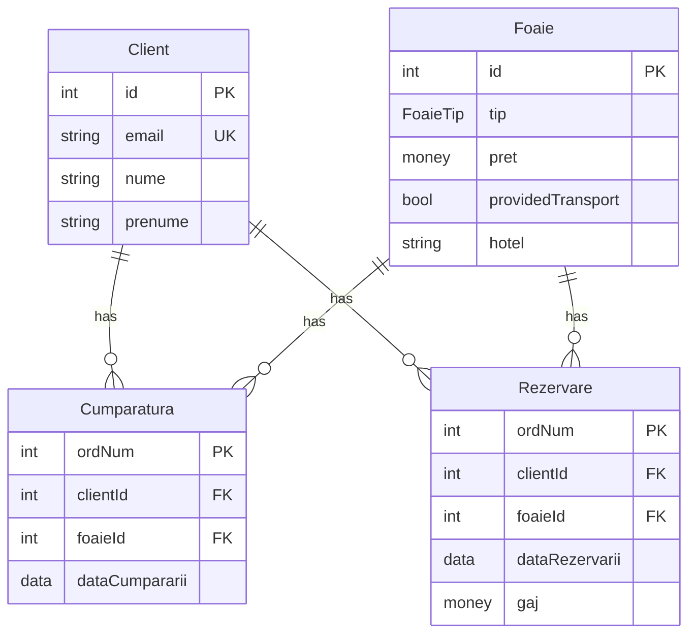

# Proiectarea aplicației cu BDD

Tema: BDD международной туристической фирмы, предоставляющей услуги по организации отдыха
на различных курортах (морских, горных) или по организации групповых путешествий 
по различным маршрутам.

## 1. Analiza activităţii economice a organizaţiei descentralizată din domeniului concret din lumea reală

Elementele necesare de funcționare a unei firme 
care furnizează clienților seriviciile de turism în țări străine 
o să fie următoarele:

- O bază de contacte sau liste de numere mobile ale organizațiilor turistice din diferite țări.
  Acestea vor fi folosite pentru pregătirea rezervărilor la hoteluri, locuri recunoscute,
  transport, etc.

- Datele referitor la locații și hotele sau servicii de divertisment
  care pot fi folosite pentru a măsura costurile așteptate, practice sau optimale după locație
  sau pentru a aprecia calitatea acestor servicii.

- Agenții tot aceeași companii, care operează în alte țări.
  Responsabilitățile acestora pot fi întâlnirea clienților de pe avion sau autobuz,
  aranjarea încasării acestora în hoteluri, ghidarea peste locuri recunoscute,
  administrarea bugetului, recomandarea unor instituții de divertisment.
  Datele pot include zilele de lucru, salariul, contractele de lucru în termeni specifici ai anului,
  datele statistice după țară.

- Datele despre clienți precedenți, locurile lor vizitate, statistică de cât de tare
  le-a plăcut locația sau instituția, preferințele lor față de cost, etc.

- Oficii în mai multe orașe peste țară.

- O linie mobilă care permite discutarea detaliilor pe telefon.

- O pagină web care permite accesarea informațiilor despre serviciile companiei,
  și poate automatizarea unor pași ca selectarea locației, rezervarea hotelului și a transportului,
  colectarea copiilor documentelor necesare și rezervarea datei și a timpului pentru consultație.

- Un sistem informatic care permite a accesa aceste informații în mod direct și ușor
  de fiecare filială (oficii independenți răspândite peste țară).

- Un sistem de raportare extensivă ca analiștii să poată lua deciziile ca 
  gestionarea bugetului companiei, angajarea specialiștii noi,
  crearea unor filiale adaugătoare, ajustarea prețului serviciilor,
  etc.

Însă, în continuare, vom explica doar partea busness-ului care se ocupă cu 
rezervarea și vânzarea de foi turistice.

O foaie turistică presupune un pachet de servicii care poate include transportul,
hotelul, și alte servicii de divertisment.
Acesta poate fi cumpărat de pe site, sau de la unul din oficii.
Încă, o foaie poate fi rezervată, achitând doar o parte din întregul cost.

## 2. Schema alocării geografice a subdiviziunilor organizaţiei descentralizate din domeniului concret din lumea reală

Să spunem că compania să existe în Moldova și România, cu câte 3 oficii în fiecarea din acestea.
Oficiul directorului se află la unui din acestea la Chișinău. 
Alți oficii din Moldova sunt în Bălți și Cahul, iar cei din România sunt în Iași, Galați și Bacău.

Compania păstrează datele ce țină de contacte și lucrători peste hotare în țările unde aceștia se regăsesc,
pe niște serveri independente, gestionate manual de câțiva lucrători în niște centre de date relativ mici.
Introducerea datelor se realizează ori de angajați care gestionează acestea,
ori la distanță din oarecare din țări principale folosind aplicația internă.

Am făcut o diagramă aproximativă. 
Am scris "Foi" doar la unele noduri, deoarece presupunem că acestea sunt păstrate într-o singură bază de date, per țară.
Aceasta poate fi diferit, și chiar în continuare voi da un exemplu unde ambele noduri au căte o tabelă de foi.
Structura sistemelor între țări care provizionează serviciile este identică (Moldova și România).
Am făcut ca fiecare țara străină să aibă doar unul singur oficiu cu o singură bază de date.
Datele necesare o să fie copiate și păstrate în tările principale cu oficiile în mod regular.
Aceasta poate fi realizat prin interogarea elementelor din tabele care au fost actualizate
după data trecută de ultimă sincronizare.
Prin urmare, avem mai puține comunicații între diferite țări, reducând presiunea la serveri.
> Presupun că actualizarea bazelor de date din țări străine nu este frecventă, 
> așadar așa structură este logică.

## 4.	Proiectarea bazelor de date locale pe fiecare nod al BDD.

În continuare vom examina doar partea furnizorilor de servicii,
adică oficiile din Moldova și România.

Fiecare nod o să aibă niște tabele proprii, identice între noduri.

> FoaieTip poate avea valorile: Munte, Mare, Excursie.

 
Notez, că la unul din noduri tabelul Foaie o să fie partiționat după câmpul `tip`,
deci tabelul respectiv de fapt va arăta puțin diferit.
Încă, nu arăt tabelele adăugătoare, ca copii.

## 5. Planificarea fragmentelor (partiţiilor) obiectelor necesare (fragmente, replici, linkuri, snapshoturi) pe fiecare nod al BDD

O să simplificăm sistemul și mai mult, lăsând doar două noduri din Moldova.

O să spunem că fiecare din acestea are foile lui, dar poate referi și la alte foi.

O să spunem că oficiul din Chișinău își ține o copie a foilor propuse de Bălți (replică),
și o legătură cu tabelul clienților din Bălți (link).

Încă, fiecare nod ține cont de lista sa de clienți, iar în cazul în care clienții
se mută din orașul primilui nod în orașul celui de-al doilea nod,
îl recunoaștem pe clientul acesta folosind email-ul lui.
Istoria cumpărăturilor și așa mai departe o putem accesa verificând toate nodurile individual.

Tot asta o să fie și în Bălți.

Fiecare nod o să aibă lista lui de cumpărături ale foilor turistice.

Cum deja am menționat, și Bălți, și Chișinău
o să aibă câte o *copie* a tabelului de foi ale celuilalt oficiu,
actualizată, zicem, o dată per sezon (2-3 luni).
După ce ele se actualizează în sursă, sunt manual copiate pe celălalt nod.
Aceasta se numește o *replică*.

Nu vom trebui să facem un sistem complicat care automat actualizează replica
în timp real, deoarece tabelul o să fie actualizat foarte rar.
Ajunge un script care rulează o dată per sezon, și adaugă înregistrările noi,
ori pur și simplu copiază întregul tabel.

Pentru demonstrație, vom realiza partiționarea orizontală a tabelului Foaie după câmpul `tip`,
adică de fapt vom crea mai multe tabele cu toate câmpurile din afară lui tip,
și vom pune în fiecare din ele doar înregistrările cu tipul respectiv.
Adică vom avea câte o tabelă pentru fiecare tip de foaie: 
`Foaie_Munte`, `Foaie_Mare`, `Foaie_Excursie`.

## 3. Proiectarea bazei de date distribuite ca proiecţia pe schema alocării geografice a subdiviziunilor organizaţiei

