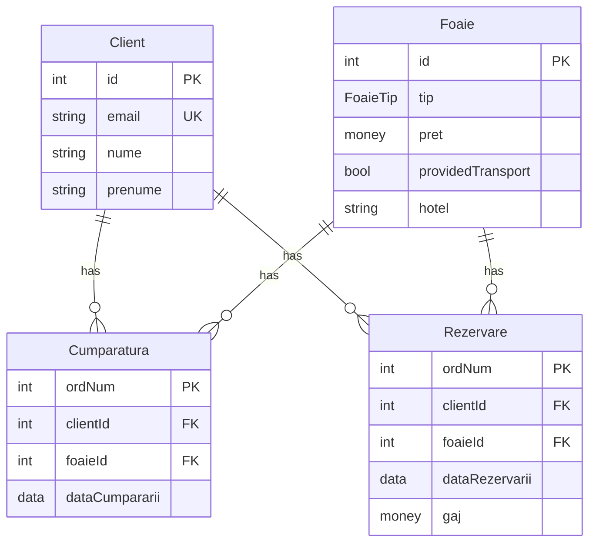
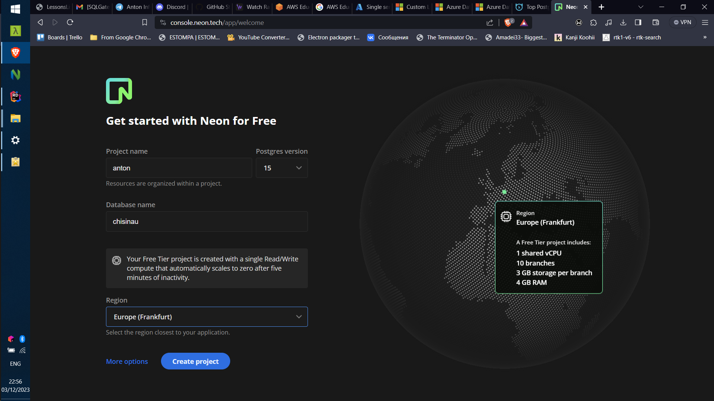
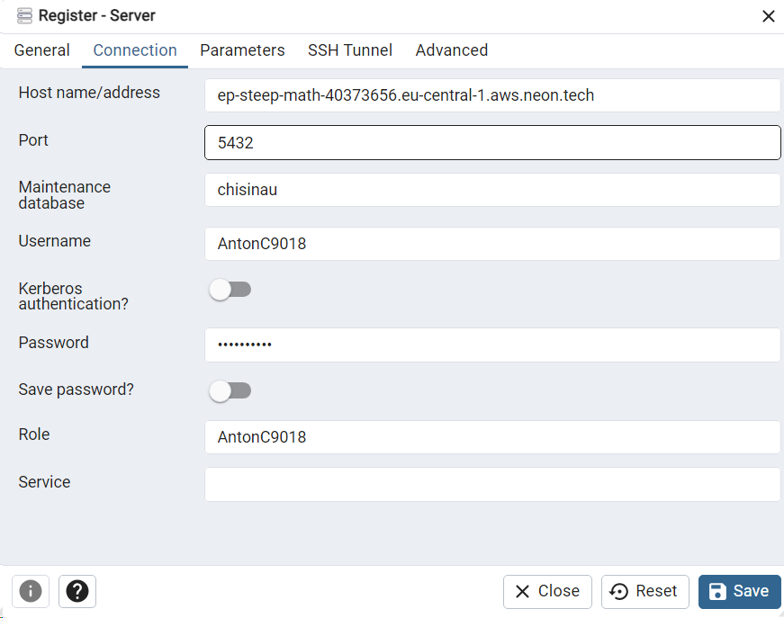

# Proiectarea aplicației cu BDD

Tema: BDD международной туристической фирмы, предоставляющей услуги по организации отдыха
на различных курортах (морских, горных) или по организации групповых путешествий 
по различным маршрутам.


## 1. Analiza activităţii economice a organizaţiei descentralizată din domeniului concret din lumea reală

Elementele necesare de funcționare a unei firme 
care furnizează clienților seriviciile de turism în țări străine 
o să fie următoarele:

- O bază de contacte sau liste de numere mobile ale organizațiilor turistice din diferite țări.
  Acestea vor fi folosite pentru pregătirea rezervărilor la hoteluri, locuri recunoscute,
  transport, etc.

- Datele referitor la locații și hotele sau servicii de divertisment
  care pot fi folosite pentru a măsura costurile așteptate, practice sau optimale după locație
  sau pentru a aprecia calitatea acestor servicii.

- Agenții tot aceeași companii, care operează în alte țări.
  Responsabilitățile acestora pot fi întâlnirea clienților de pe avion sau autobuz,
  aranjarea încasării acestora în hoteluri, ghidarea peste locuri recunoscute,
  administrarea bugetului, recomandarea unor instituții de divertisment.
  Datele pot include zilele de lucru, salariul, contractele de lucru în termeni specifici ai anului,
  datele statistice după țară.

- Datele despre clienți precedenți, locurile lor vizitate, statistică de cât de tare
  le-a plăcut locația sau instituția, preferințele lor față de cost, etc.

- Oficii în mai multe orașe peste țară.

- O linie mobilă care permite discutarea detaliilor pe telefon.

- O pagină web care permite accesarea informațiilor despre serviciile companiei,
  și poate automatizarea unor pași ca selectarea locației, rezervarea hotelului și a transportului,
  colectarea copiilor documentelor necesare și rezervarea datei și a timpului pentru consultație.

- Un sistem informatic care permite a accesa aceste informații în mod direct și ușor
  de fiecare filială (oficii independenți răspândite peste țară).

- Un sistem de raportare extensivă ca analiștii să poată lua deciziile ca 
  gestionarea bugetului companiei, angajarea specialiștii noi,
  crearea unor filiale adaugătoare, ajustarea prețului serviciilor,
  etc.

Însă, în continuare, vom explica doar partea busness-ului care se ocupă cu 
rezervarea și vânzarea de foi turistice.

O foaie turistică presupune un pachet de servicii care poate include transportul,
hotelul, și alte servicii de divertisment.
Acesta poate fi cumpărat de pe site, sau de la unul din oficii.
Încă, o foaie poate fi rezervată, achitând doar o parte din întregul cost.


## 2. Schema alocării geografice a subdiviziunilor organizaţiei descentralizate din domeniului concret din lumea reală

Să spunem că compania să existe în Moldova și România, cu câte 3 oficii în fiecarea din acestea.
Oficiul directorului se află la unui din acestea la Chișinău. 
Alți oficii din Moldova sunt în Bălți și Cahul, iar cei din România sunt în Iași, Galați și Bacău.

Compania păstrează datele ce țină de contacte și lucrători peste hotare în țările unde aceștia se regăsesc,
pe niște serveri independente, gestionate manual de câțiva lucrători în niște centre de date relativ mici.
Introducerea datelor se realizează ori de angajați care gestionează acestea,
ori la distanță din oarecare din țări principale folosind aplicația internă.

Am făcut o diagramă aproximativă. 
Am scris "Foi" doar la unele noduri, deoarece presupunem că acestea sunt păstrate într-o singură bază de date, per țară.
Aceasta poate fi diferit, și chiar în continuare voi da un exemplu unde ambele noduri au căte o tabelă de foi.
Structura sistemelor între țări care provizionează serviciile este identică (Moldova și România).
Am făcut ca fiecare țara străină să aibă doar unul singur oficiu cu o singură bază de date.
Datele necesare o să fie copiate și păstrate în tările principale cu oficiile în mod regular.
Aceasta poate fi realizat prin interogarea elementelor din tabele care au fost actualizate
după data trecută de ultimă sincronizare.
Prin urmare, avem mai puține comunicații între diferite țări, reducând presiunea la serveri.
> Presupun că actualizarea bazelor de date din țări străine nu este frecventă, 
> așadar așa structură este logică.


## 4.	Proiectarea bazelor de date locale pe fiecare nod al BDD.

În continuare vom examina doar partea furnizorilor de servicii,
adică oficiile din Moldova și România.

Fiecare nod o să aibă niște tabele proprii, identice între noduri.

> FoaieTip poate avea valorile: Munte, Mare, Excursie.


 
Notez, că la unul din noduri tabelul Foaie o să fie partiționat după câmpul `tip`,
deci tabelul respectiv de fapt va arăta puțin diferit.
Încă, nu arăt tabelele adăugătoare, ca copii.


## 5. Planificarea fragmentelor (partiţiilor) obiectelor necesare (fragmente, replici, linkuri, snapshoturi) pe fiecare nod al BDD

O să simplificăm sistemul și mai mult, lăsând doar două noduri din Moldova.

O să spunem că fiecare din acestea are foile lui, dar poate referi și la alte foi.

O să spunem că oficiul din Chișinău își ține o copie a foilor propuse de Bălți (replică),
și o legătură cu tabelul clienților din Bălți (link).

Încă, fiecare nod ține cont de lista sa de clienți, iar în cazul în care clienții
se mută din orașul primilui nod în orașul celui de-al doilea nod,
îl recunoaștem pe clientul acesta folosind email-ul lui.
Istoria cumpărăturilor și așa mai departe o putem accesa verificând toate nodurile individual.

Tot asta o să fie și în Bălți.

Fiecare nod o să aibă lista lui de cumpărături ale foilor turistice.

Cum deja am menționat, și Bălți, și Chișinău
o să aibă câte o *copie* a tabelului de foi ale celuilalt oficiu,
actualizată, zicem, o dată per sezon (2-3 luni).
După ce ele se actualizează în sursă, sunt manual copiate pe celălalt nod.
Aceasta se numește o *replică*.

Nu vom trebui să facem un sistem complicat care automat actualizează replica
în timp real, deoarece tabelul o să fie actualizat foarte rar.
Ajunge un script care rulează o dată per sezon, și adaugă înregistrările noi,
ori pur și simplu copiază întregul tabel.

Pentru demonstrație, vom realiza partiționarea orizontală a tabelului Foaie după câmpul `tip`,
adică de fapt vom crea mai multe tabele cu toate câmpurile din afară lui tip,
și vom pune în fiecare din ele doar înregistrările cu tipul respectiv.
Adică vom avea câte o tabelă pentru fiecare tip de foaie: 
`Foaie_Munte`, `Foaie_Mare`, `Foaie_Excursie`.


## 3. Proiectarea bazei de date distribuite ca proiecţia pe schema alocării geografice a subdiviziunilor organizaţiei


## Proiectarea primului nod pe PostreSQL

### Selectarea host-ului de o bază de date

GitHub oferă un pachet pentru dezvoltatori care include credite pentru o mulțime de servicii.
Între ele sunt doar unele permit hosting-ul unei baze de date relaționale: Azure și Heroku.

Azure permite crearea unei baze de date PostgreSQL, însă PostreSQL-ul acolo este prea scump
(150+ de dolari per lună, pe când pachetul conține doar 100 de dolari).
Însă, Azure permite crearea unei baze de date SqlServer al lui Microsoft
care-i mult mai ieftină (de la aprox. 5 dolari pe lună).
Este logic că Microsoft și-ar promova produsul propriu pe platforma lor.

Heroku dă un credit de 13 de dolari per lună, însă cere să conectez un card bancar,
ceea ce eu nu vreau să fac, ca să nu fiu taxat după ce se termină creditul după ce uit
de proiect.

Am mai căutat niște servicii gratuite care permite a folosi o bază de date PostreSQL slabă
pentru teste, și am găsit Neon. 
Oferă un tier gratuit destul de generos care permite să setez o bază de date PostreSQL.
Este important ca mașina să fie vizibilă pe internet în mod normal,
ca să putem seta un link de pe celelaltă bază de date, și invers. 


### Configurarea bazei de date

Configurarea de bază la acest serviciu este minimă:



Ca să ne conectăm la această bază de date și să rulăm interogări,
ar trebui să intalez ceva client care permite să fac asta.
Am găsit [pgAdmin](https://www.pgadmin.org/).

Am configurat o conexiune nouă în pgAdmin. 
Despre asta este și în [documentația lor](https://neon.tech/docs/connect/connect-postgres-gui).

.

Urmează să creez tabelele de bază.
La început voi crea tabelul Foi fără partiționare.

Am folosit ChatGPT pentru a-mi genera codul care crează tabelele pentru a sălva timpul.

```
Generate the postgresql sql code that creates tables that correspond to the following mermaid entity diagram:
... sursa diagramei de mai sus ...
```

```sql
CREATE TABLE Client (
    id SERIAL PRIMARY KEY,
    email VARCHAR(255) UNIQUE,
    nume VARCHAR(255),
    prenume VARCHAR(255)
);

CREATE TYPE FoaieTip AS ENUM ('Munte', 'Mare', 'Excursie');

CREATE TABLE Foaie (
    id SERIAL PRIMARY KEY,
    tip FoaieTip,
    pret MONEY,
    providedTransport BOOLEAN,
    hotel VARCHAR(255)
);

CREATE TABLE Rezervare (
    ordNum SERIAL PRIMARY KEY,
    clientId INT REFERENCES Client(id),
    foaieId INT REFERENCES Foaie(id),
    dataRezervarii DATE,
    gaj MONEY
);

CREATE TABLE Cumparatura (
    ordNum SERIAL PRIMARY KEY,
    clientId INT REFERENCES Client(id),
    foaieId INT REFERENCES Foaie(id),
    dataCumpararii DATE
);

ALTER TABLE Rezervare
    ADD CONSTRAINT fk_Rezervare_clientId
    FOREIGN KEY (clientId)
    REFERENCES Client(id);

ALTER TABLE Rezervare
    ADD CONSTRAINT fk_Rezervare_foaieId
    FOREIGN KEY (foaieId)
    REFERENCES Foaie(id);

ALTER TABLE Cumparatura
    ADD CONSTRAINT fk_Cumparatura_clientId
    FOREIGN KEY (clientId)
    REFERENCES Client(id);

ALTER TABLE Cumparatura
    ADD CONSTRAINT fk_Cumparatura_foaieId
    FOREIGN KEY (foaieId)
    REFERENCES Foaie(id);

```

Am citit mai mult despre sintaxele. 
* `SERIAL` este ca `IDENTITY(1, 1)` în SQLServer, deci adaugă autoincrement.
  Ideal pentru chei.

* PostgreSQL are tipul `BOOLEAN` care este echivalent cu `BIT` în SQLServer.

* [`ENUM`](https://www.postgresql.org/docs/current/datatype-enum.html) este acea quality of life feature
  care îmi lipsește tare mult în SqlServer.
  Păstrează valorile în 4 bytes, și le ordonează conform ordinii în declarare.


Tot cu ChatGPT am generat niște înregistrări de test.

```sql
INSERT INTO Client (email, nume, prenume) VALUES
    ('test1@example.com', 'Doe', 'John'),
    ('test2@example.com', 'Smith', 'Jane'),
    ('test3@example.com', 'Johnson', 'Bob');

INSERT INTO Foaie (tip, pret, providedTransport, hotel) VALUES
    ('Munte', 100.00, true, 'Hotel A'),
    ('Mare', 150.00, false, 'Hotel B'),
    ('Excursie', 200.00, true, 'Hotel C');

INSERT INTO Rezervare (clientId, foaieId, dataRezervarii, gaj) VALUES
    (1, 1, TO_DATE('2023-01-15', 'YYYY-MM-DD'), 50.00),
    (2, 2, TO_DATE('2023-02-20', 'YYYY-MM-DD'), 75.00),
    (3, 3, TO_DATE('2023-03-25', 'YYYY-MM-DD'), 100.00);

INSERT INTO Cumparatura (clientId, foaieId, dataCumpararii) VALUES
    (1, 1, TO_DATE('2023-01-10', 'YYYY-MM-DD')),
    (2, 2, TO_DATE('2023-02-15', 'YYYY-MM-DD')),
    (3, 3, TO_DATE('2023-03-20', 'YYYY-MM-DD'));
```


### Partiționarea tabelelor

Nu-mi place cum sugerează să realizez partiționarea tabelelor în 
[documentația de la PostgreSQL](https://www.postgresql.org/docs/current/ddl-partitioning.html#DDL-PARTITIONING-USING-INHERITANCE),
folosind moștenirea.
Data trecută când citeam informațiile, această metodă era unica, posibil am citit o versiune veche.

PostreSQL de fapt oferă o posibilitate de a crea partiții cu 
[`PARTITION OF`](https://www.postgresql.org/docs/current/ddl-partitioning.html#DDL-PARTITIONING-DECLARATIVE).
Am să încerc să folosesc această metodă.
În cazul nostru, deoarece vom avea doar 3 tipuri de foi, și câte o partiție pentru fiecare tip,
nu trebuie să avem câmpul `tip` în tabelele partiționate.
Asta poate fi atins folosind `LIST` partitioning.

Deoarece nu este posibil să creem partiții pentru un tabel deja existent,
trebuie să facem niște prelucrări:

* Renumim tabelul veche la `Foaie_old`.

* Creăm un tabel nou, partiționat după `tip`, cu numele `Foaie`.

* Dăm drop la toate constrângerile de chei străine care se referă la `Foaie_old`.

* Creăm partițiile pentru `Foaie`.

* Introducem datele din tabelul veche în partiții.

* Dăm drop la tabelul veche.

* Restabilim constrângerile de chei străine.

```sql
ALTER TABLE Foaie RENAME TO Foaie_old;

CREATE TABLE Foaie (
    id SERIAL PRIMARY KEY,
    pret MONEY,
    providedTransport BOOLEAN,
    hotel VARCHAR(255),
    tip FoaieTip
) PARTITION BY LIST (tip);

ALTER TABLE Rezervare
    DROP CONSTRAINT fk_Rezervare_foaieId;
ALTER TABLE Cumparatura
    DROP CONSTRAINT fk_Cumparatura_foaieId;
ALTER TABLE Rezervare
    DROP CONSTRAINT rezervare_foaieid_fkey;
ALTER TABLE Cumparatura
    DROP CONSTRAINT cumparatura_foaieid_fkey;

CREATE TABLE Foaie_Munte PARTITION OF Foaie FOR VALUES IN ('Munte');
CREATE TABLE Foaie_Mare PARTITION OF Foaie FOR VALUES IN ('Mare');
CREATE TABLE Foaie_Excursie PARTITION OF Foaie FOR VALUES IN ('Excursie');

INSERT INTO Foaie_Munte (id, pret, providedTransport, hotel, tip)
    SELECT id, pret, providedTransport, hotel, tip FROM Foaie_old WHERE tip = 'Munte';
INSERT INTO Foaie_Mare (id, pret, providedTransport, hotel, tip)
    SELECT id, pret, providedTransport, hotel, tip FROM Foaie_old WHERE tip = 'Mare';
INSERT INTO Foaie_Excursie (id, pret, providedTransport, hotel, tip)
    SELECT id, pret, providedTransport, hotel, tip FROM Foaie_old WHERE tip = 'Excursie';
  
DROP TABLE Foaie_old;

ALTER TABLE Rezervare
    ADD CONSTRAINT fk_Rezervare_foaieId
    FOREIGN KEY (foaieId)
    REFERENCES Foaie(id);

ALTER TABLE Cumparatura
    ADD CONSTRAINT fk_Cumparatura_foaieId
    FOREIGN KEY (foaieId)
    REFERENCES Foaie(id);
```

Primim eroarea "unique constraint on partitioned table must include all partitioning columns",
când încercăm să creăm tabela partiționată.
Aceasta este logic, deoarece id-ul o să fie incrementat separat în fiecare partiție (?).
Problema este menționată și [aici în documentație](https://www.postgresql.org/docs/current/ddl-partitioning.html#DDL-PARTITIONING-DECLARATIVE-LIMITATIONS):

> To create a unique or primary key constraint on a partitioned table, the partition keys must not include any expressions or function calls and the constraint's columns **must include all of the partition key columns**. This limitation exists because the individual indexes making up the constraint can only directly enforce uniqueness within their own partitions; therefore, the partition structure itself must guarantee that there are not duplicates in different partitions.

Asta parcă implică și ceea că id-ul o să fie incrementat separat. Nu dorim asta.
Însă cred că nu este posibil de rezolvat, lăsând doar id-ul în calitate de cheie primară.
Asta cred că nu este o problemă la chei străine.

Am să fac un mic test pentru a mă asigura că de fapt id-urile sunt generate separat în fiecare partiție.

```sql
CREATE TABLE test1 (
    id SERIAL,
    hello text,
    v int
) PARTITION BY LIST (hello);

CREATE TABLE test1_a PARTITION OF test1 FOR VALUES IN ('a');
CREATE TABLE test1_b PARTITION OF test1 FOR VALUES IN ('b');

INSERT INTO test1 (hello, v) VALUES ('a', 1);
INSERT INTO test1 (hello, v) VALUES ('b', 2);
INSERT INTO test1_a (hello, v) VALUES ('a', 3);
INSERT INTO test1_b (hello, v) VALUES ('b', 4);

SELECT * FROM test1
```

| id | hello | v |
|----|-------|---|
| 1  | "a"   | 1 |
| 3  | "a"   | 3 |
| 2  | "b"   | 2 |
| 4  | "b"   | 4 |

Deci de fapt nu am avut dreptate, și acestea au fost generate separat.
Din această cauză putem să facem cheia primară din `id` și `tip` fără griji.

```sql
CREATE TABLE Foaie (
    id SERIAL,
    pret MONEY,
    providedTransport BOOLEAN,
    hotel VARCHAR(255),
    tip FoaieTip,
    PRIMARY KEY (id, tip)
) PARTITION BY LIST (tip);
```

Toate comenzile se rulează, din afară creării cheilor străine.
Totuși este necesar ca această cheie să fie cheia primară.

Am căutat, și parcă este imposibil de realizat asta.
Putem însă simula asta cu un check constraint.
Asta n-o să fie performant, și n-o să folosim asta probabil în lumea reală.
Este cam trist.

```sql
ALTER TABLE Rezervare
    ADD CONSTRAINT fk_Rezervare_foaieId
    CHECK (foaieId IN (SELECT id FROM Foaie));

ALTER TABLE Cumparatura
    ADD CONSTRAINT fk_Cumparatura_foaieId
    CHECK (foaieId IN (SELECT id FROM Foaie));
```

Dar nici asta nu putem folosi, zice "cannot use subquery in check constraint"
deoarece am folosit un `SELECT` înăuntru.
Așa că rămânem fără chei străine, ci pur și simplu cu câmpuri.

Să notez, că cu totuși că partițiile includ câmpul `tip`,
cred că acesta nu este păstrat pe disk.
Nu ar fi asta logic, deoarece informația această deja există în ceea care partiție noi folosim.
Deci presupun că când are loc un insert în una din partiții,
o valoare pentru `tip` există doar din acea cauză că tipul tabelului
este același și la definiție, și la partiții.